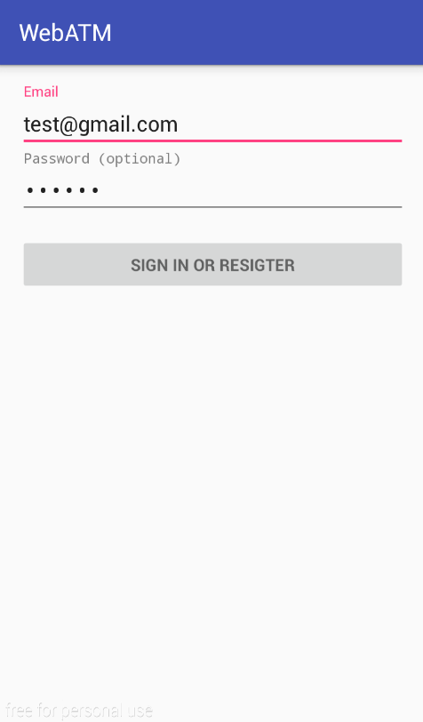
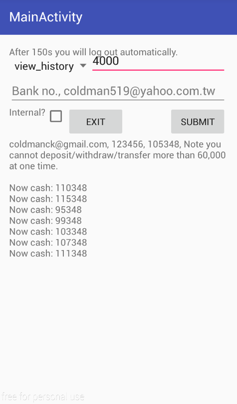
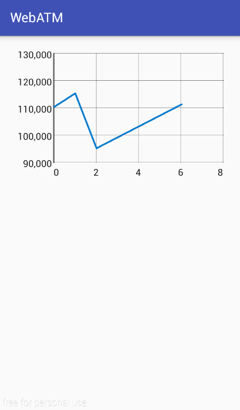

# WebATM
## Introduction
A WebATM-simulated program with server-side is written by Java and client-side written by Android

## Demos
- Login Activity

- Main Activity

- Line View Activity

## Server-Side Android App
Please refer to [WebATMServer](https://github.com/coldmanck/WebATMServer) for detail.
